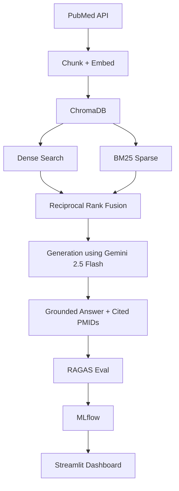
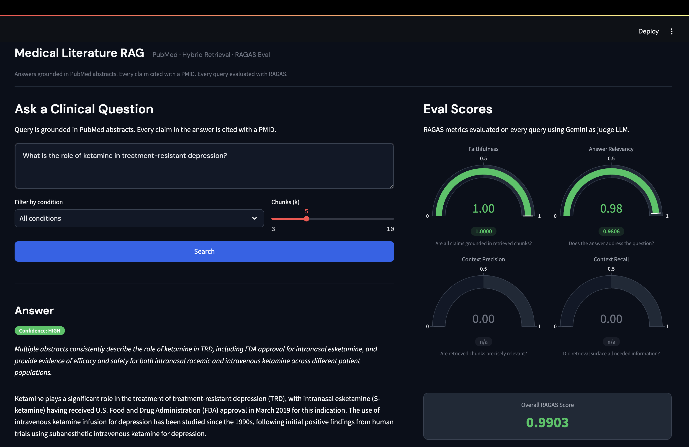
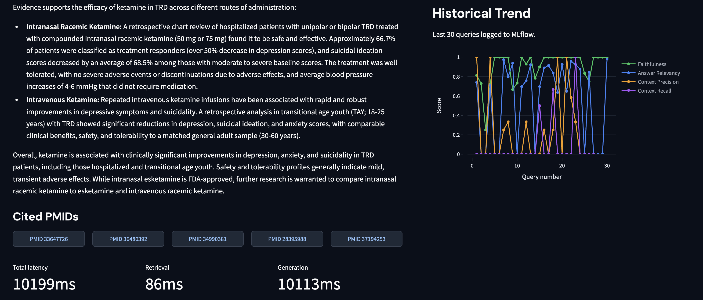
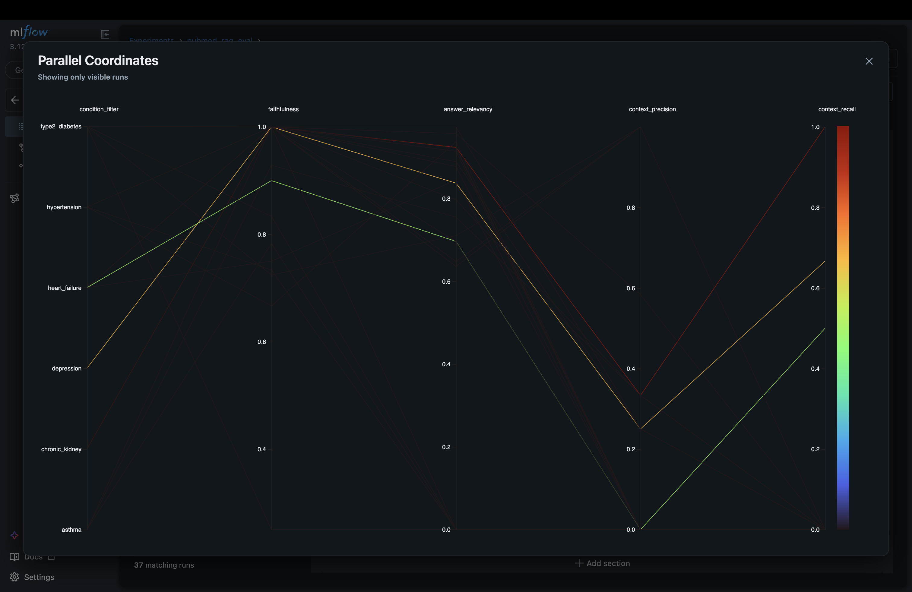

# Medical Literature RAG + Eval Dashboard

A production-style RAG system over PubMed medical abstracts with a live RAGAS evaluation dashboard. Ask clinical questions in natural language - the system retrieves relevant abstracts, generates a grounded answer with cited PMIDs, and scores every query with four RAGAS metrics in real time.

---

## RAGAS Benchmark Results

25 hand-crafted Q&A pairs across 6 clinical conditions.

| Metric | Score |
|---|---|
| Faithfulness | 0.9027 |
| Answer Relevancy | 0.5976 |
| Context Precision | 0.2133 |
| Context Recall | 0.0867 |

All runs logged to MLflow with 10 metrics per execution.

---

## Architecture



---

## Stack

| Layer | Tool |
|---|---|
| Data | PubMed E-utilities API |
| Embeddings | `all-MiniLM-L6-v2` (sentence-transformers) |
| Vector store | ChromaDB |
| Retrieval | Hybrid dense + BM25, fused with RRF |
| LLM | Gemini 2.5 Flash |
| Evaluation | RAGAS |
| Tracking | MLflow |
| Frontend | Streamlit |
| CI | GitHub Actions |

---

## Corpus

574 chunks across 6 conditions: Type 2 Diabetes, Hypertension, Heart Failure, Depression, Chronic Kidney Disease, Asthma.

---
## Dashboard





## MLflow Tracking



---

## Local Setup

```bash
git clone https://github.com/harshitamandalika/medical-rag
cd medical-rag
pip install -r requirements.txt
cp .env.example .env        # add GEMINI_API_KEY
streamlit run dashboard/app.py
```

View MLflow runs:

```bash
mlflow ui --backend-store-uri ./mlflow_runs
```

Run tests:

```bash
pytest tests/ -v
```
